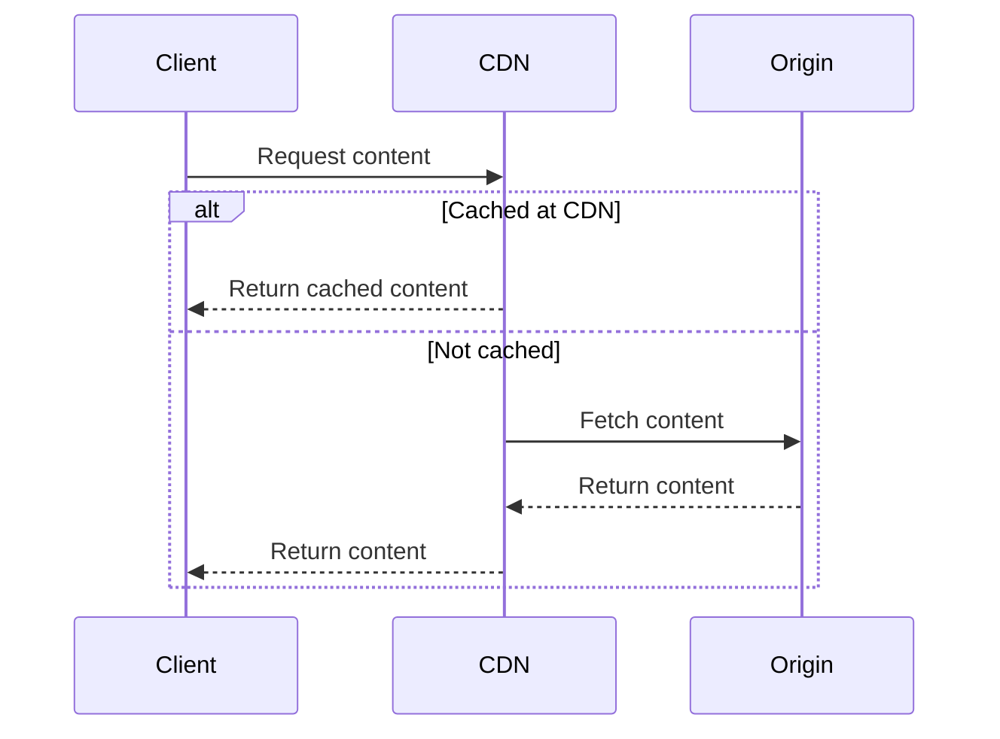

## What is a CDN (Content Delivery Network)?

### The Basic Concept

You might be wondering, what exactly is a CDN? Imagine your website is a famous pizza chain. Without a CDN, every customer would have to travel to your one and only pizza shop—maybe on the other side of the world. That’s slow and frustrating. A CDN solves that by setting up pizza shops (servers) all around the world, so your customers (users) get their pizza (content) hot and fast.

A Content Delivery Network (CDN) is a group of servers located in different parts of the world. These servers help deliver static content, like images, videos, or web pages, to users more quickly. When someone visits a website that uses a CDN, the server that’s closest to them will deliver the content—if it’s already stored there.

Many popular Content Delivery Networks (CDNs) do more than just deliver static content. They also offer important features like DDoS protection, Edge Computing, and Web Application Firewalls (WAF) to improve website security and performance. We’ll dive deeper into these CDN features in future articles, so stay tuned!

## CDN Workflow

The diagram below shows a simple example of how a CDN works.

1. A person visits a website or tries to load something like an image, video, or web page. Their device sends a request to the CDN to get that content.

2. The CDN checks if it already has a copy of the content saved. This is called "cached."

3. If the content *is* cached:
    - The CDN sends it back to the person right away.

4. If the content is *not* cached:
   - The CDN asks the origin server (the main server where the website lives) for the content.
   - The origin server sends the content back to the CDN.
   - The CDN then sends the content to the person. It usually saves a copy so it’s ready to go the next time someone asks for it.

### Why CDNs Matter in Modern Web Applications

Today’s users expect everything to be lightning fast. A CDN ensures your site loads quickly, no matter where your visitors are. But it’s not just about speed—CDNs improve uptime, security, and handle sudden spikes in traffic without breaking a sweat.

### Popular CDN Options You Should Know About

When it comes to optimizing website performance, security, and scalability, choosing the right **Content Delivery Network (CDN)** is critical. Below is a list of the most popular CDN providers used by major companies worldwide.

#### 1. Cloudflare
Cloudflare operates one of the **largest global networks**, known for its **ease of deployment**, robust **DDoS protection**, and **Web Application Firewall (WAF)**. Companies ranging from Shopify to IBM trust Cloudflare as their primary CDN provider. One of my domains is hosted on Cloudflare, and the seamless integration made it easy to enable their CDN services right out of the box (but I chose not to).

#### 2. Amazon CloudFront
If you're already invested in the **AWS ecosystem**, then **Amazon CloudFront** offers **tight integration** with other AWS services, making it an excellent option. Companies like **Supercell** (I used to be a big Clash of Clans player!), **Atlassian**, and **Prime Video** rely on CloudFront to deliver **high-speed, scalable content** around the world.

#### 3. Akamai
With a network that spans over **365,000 servers** in **135+ countries**, Akamai is a **leading enterprise CDN provider**. I worked with Akamai in a previous company, and although it took a bit of time to get up to speed, I quickly realized how powerful it is. Akamai provided **global coverage** and significantly improved our website’s performance and security posture.

#### 4. Fastly
Fastly has a **developer-centric approach** and is popular for its **real-time control**, **instant cache purging**, and **edge computing system** capabilities. Companies like **Paramount Global**, **JetBlue**, and **USA TODAY** use Fastly’s CDN to serve a variety of industries, proving its **versatility** and **high-performance edge computing**.

#### 5. Microsoft Azure Front Door
For organizations already using **Microsoft Azure**, **Azure Front Door** offers **global load balancing**, **application acceleration**, and **advanced security** at the edge. Its seamless integration with the Azure platform makes it an appealing choice for **enterprises looking for scalable and reliable CDN services**.

## What’s Next: Choosing and Setting Up My CDN
Understanding the basics of a CDN is the first step toward making your website faster, more secure, and scalable. In the next post, I’ll reveal which CDN I chose and walk you through how I set it up from start to finish. Stay tuned—you won’t want to miss it!